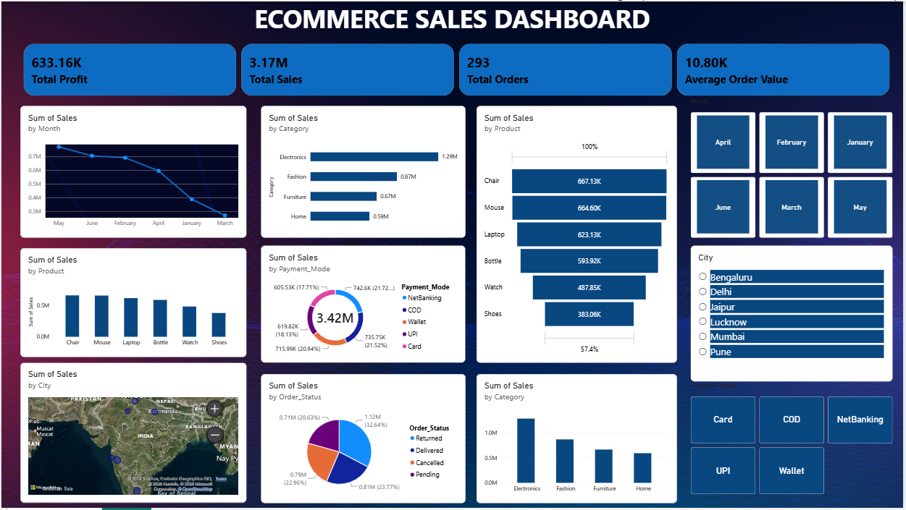

# E-Commerce Sales Data Analysis | Python, MySQL & Power BI

An end-to-end data analytics project that takes raw e-commerce order data through cleaning in Python, SQL analysis in MySQL, and an interactive Power BI dashboard to understand **sales performance, profit, and customer ordering patterns**.

**Tech stack:** Python · Pandas · NumPy · Jupyter Notebook · MySQL · SQL · Power BI · Excel

---

## Dashboard Preview

## 📊 Dashboard Preview



---

## Business Problem

An e-commerce business needs a clear view of how it is performing. This project answers questions a sales or operations team would ask:

- What are the **total sales, profit, and number of orders**?
- What is the **average order value**?
- Which **categories and products** drive the most sales?
- Which **cities** bring the most revenue?
- Which **payment modes** do customers prefer?
- How do sales change **month by month**?
- How are orders distributed by **order status**?

---

## Key Metrics (Power BI Dashboard)

| KPI | Value |
|---|---:|
| Total Sales | 3.17M |
| Total Profit | 633.16K |
| Total Orders | 293 |
| Average Order Value | 10.80K |

---

## Workflow

```text
Raw Excel Data
      ↓
Python / Pandas  →  Cleaning, transformation, calculated columns
      ↓
MySQL            →  SQL business analysis
      ↓
Power BI         →  Interactive dashboard
```

---

## 1. Data Cleaning & Preparation (Python)

Done in Jupyter Notebook using Pandas and NumPy:

- Loaded the raw Excel dataset and explored its structure
- Checked and handled missing values
- Checked and removed duplicate records
- Cleaned and standardized inconsistent values
- Converted columns to the correct data types
- Created calculated columns for analysis
- Prepared the cleaned dataset for SQL and Power BI

---

## 2. SQL Analysis (MySQL)

SQL queries were written to calculate:

| Analysis | Description |
|---|---|
| Total Sales | Overall revenue |
| Total Profit | Overall profit |
| Total Orders | Number of orders |
| Sales by Category | Best and weakest categories |
| Sales by Product | Top-selling products |
| Sales by City | Highest-revenue locations |
| Sales by Payment Mode | Preferred payment methods |
| Sales by Order Status | Order outcome breakdown |
| Monthly Sales | Sales trend over time |

All queries are in [`SQL/Ecommerce_Sales_Queries.sql`](SQL/Ecommerce_Sales_Queries.sql).

---

## 3. Power BI Dashboard

An interactive dashboard with **KPI cards** (Total Sales, Total Profit, Total Orders, Average Order Value) and visuals for:

- Sales by Month
- Sales by Category
- Sales by Product
- Sales by City
- Sales by Payment Mode
- Sales by Order Status

---

## Repository Structure

```text
Ecommerce-Sales-Data-Analysis/
│
├── Dataset/
│   └── Ecommerce_Unclean_2026.xlsx           # Raw dataset
│
├── Python/
│   └── E_Commerce_Sales_Analytics.ipynb      # Cleaning & transformation
│
├── SQL/
│   └── Ecommerce_Sales_Queries.sql           # MySQL analysis queries
│
├── PowerBI/
│   └── Ecommerce_Sales_Dashboard.pbix        # Power BI dashboard
│
└── Screenshots/
    └── Ecommerce_Sales_Dashboard.png         # Dashboard screenshot
```

---

## How to Run

1. Clone the repository.
2. Open `Python/E_Commerce_Sales_Analytics.ipynb` in Jupyter Notebook and run all cells (requires `pandas`, `numpy`).
3. Load the cleaned data into MySQL and run `SQL/Ecommerce_Sales_Queries.sql`.
4. Open `PowerBI/Ecommerce_Sales_Dashboard.pbix` in Power BI Desktop.

---

## Skills Demonstrated

- **Python:** data cleaning, type conversion, calculated columns (Pandas, NumPy)
- **SQL / MySQL:** aggregation, grouping, business analysis queries
- **Power BI:** KPI cards, interactive dashboards, data visualization
- **Analytics:** turning raw sales data into business insights

---

## Author

**Hemant Kumar Gavaria** — Aspiring Data Analyst

[LinkedIn](https://www.linkedin.com/in/hemantkumar-g) · [GitHub](https://github.com/Hemantkumar18)
